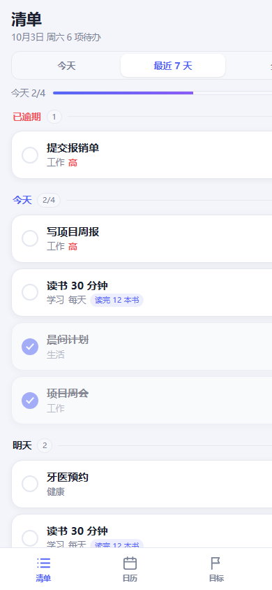
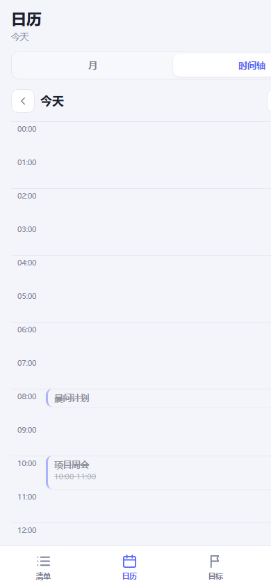
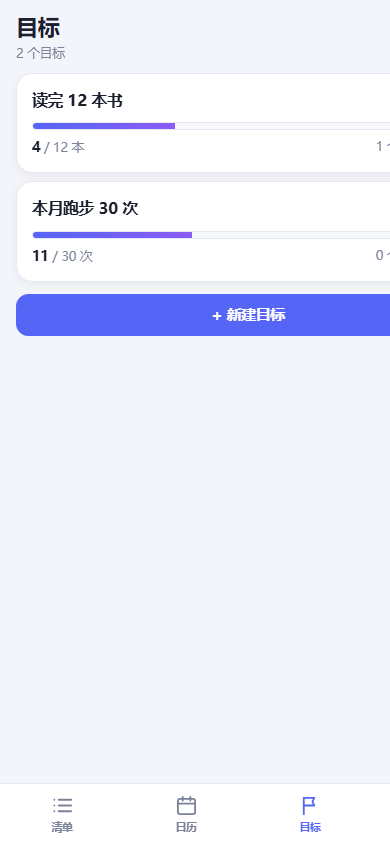
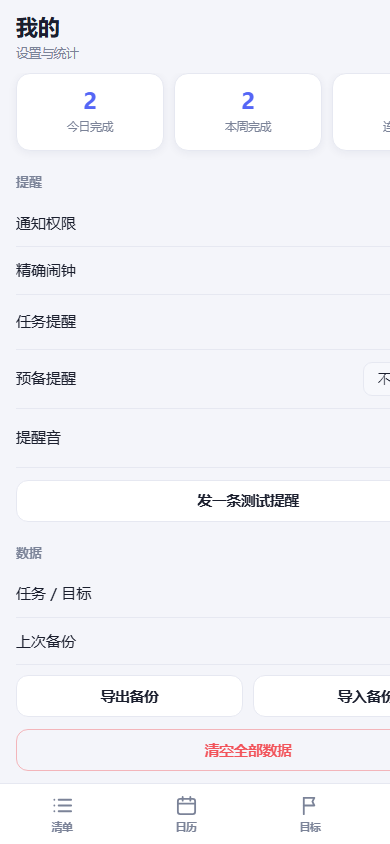

<div align="center">

# 时光轴

**提醒必达的本地日程工具**

Windows 桌面版  Android 手机版  数据只存本机


</div>

---

## 为什么做这个

市面上的日程工具，要么功能堆砌，要么提醒不可靠。

这个项目只赌一件事：

> **到点一定响，而且能直接在通知上打勾。**

所以它砍掉了番茄钟、任务附件、自定义音乐、周视图、云同步  把省下的力气全砸在「提醒链路」上。

---

## 截图

| 清单 | 时间轴 |
|:---:|:---:|
|  |  |
| **目标** | **我的** |
|  |  |

---

## 手机版（Android）

APK 3.67 MB  targetSdk 34  minSdk 22

| 功能 | 说明 |
|---|---|
| **提醒必达** | 预调度系统通知，**关掉 App 也照响**；预备提醒 + 到点提醒；通知内联「完成 / 稍后10分钟」；开机自动恢复 |
| **提醒健康检查** | 自动检测 5 项：通知权限 / 提醒渠道 / 准时性（精确闹钟）/ 电池白名单 / 厂商自启动；异常时清单页顶部出现状态条，点开可**一键直达对应系统页** |
| **清单** | 按日期分组（今天 / 明天 / 后续 / 未安排），已逾期独立分组 + 一键顺延到今天 |
| **时间轴** | 24 小时垂直排布，任务块按时长占位，红线标当前时刻 |
| **快速添加** | 全局 FAB + 中文自然语言解析 |
| **目标** | 点目标卡进详情，内联输入即可为该目标添加任务 |
| **重复任务** | 每天 / 工作日 / 每周 / 每月；勾选只完成当天，不影响整个系列 |
| **一键清除已完成** | 只清非重复的已完成任务，重复任务系列保留；可撤销 |
| 统计 | 今日完成 / 本周完成 / 连续天数 |

## 桌面版（Windows）

免安装绿色版  Electron 打包

| 功能 | 说明 |
|---|---|
| 五种视图 | 日（24 小时时间轴）/ 周 / 月 / 列表 / 目标 |
| 每日时间安排 | 作息模板：编辑时间块  一键套用到某天；默认去重、可选覆盖 |
| 目标 | 目标值 + 阶段里程碑（进度达标自动点亮）+ 手动补充进度 |
| 番茄钟 | 25/5/15 可调，圆环倒计时，可关联任务 |
| 提醒音乐 | 任务时间结束时播放；可上传自定义音乐，不设置则用内置提示音 |
| 任务附件 | 任意文件挂到任务下（本地 IndexedDB 存储） |
| 导入导出 | JSON 备份 / ICS 日历导出（可导入手机日历） |

---

## 技术要点

### 1. 提醒不依赖进程存活

```
JS schedule()
   AlarmManager.setExactAndAllowWhileIdle(RTC_WAKEUP, ...)
   PendingIntent  BroadcastReceiver
   到点由【系统】拉起接收器发通知
```

关掉 App、重启手机都不影响。
**明确不用前台服务**  进程死了它也死，还费电、还扰民。

### 2. 零 Java 复用系统广播

Capacitor 的 local-notifications 插件自带 `LocalNotificationRestoreReceiver`（开机恢复 + 过期补发）。
在自己的 manifest 里**再声明一次同名 receiver 并追加 intent-filter**，manifest merger 会自动合并  不写一行 Java 就拿到 `TIMEZONE_CHANGED` / `TIME_SET` / `DATE_CHANGED` / `MY_PACKAGE_REPLACED` 四个广播。

### 3. 渠道不可变性的处理

Android 规定 `NotificationChannel` 创建后 **`importance` 无法通过代码修改**。
所以换渠道只能换 id：`reminders`  `reminders_v2`，并在启动时 `deleteChannel` 清理旧渠道。

### 4. 中文自然语言解析

```
明天下午3点开会 1小时 #工作
   明天 15:00  60 分钟  分类「工作」 标题「开会」
```

支持：今天/明天/后天/大后天、周一到周日（含下周）、上午/下午/晚上/中午/凌晨、`15:00`、`3点半`、`1h`/`30分钟`、`#分类`。

### 5. 重复任务的实例化

「每天」的任务用 `doneMap: { '2026-10-03': true }` 按天记录完成状态。
勾选只完成当天那一次，**不影响整个系列**；目标进度按**实际完成次数**累加。

### 6. 本地原生插件补 JS 的短板

JS 打不开系统设置页，所以写了 `SystemSettingsPlugin`：

- 探测电池白名单真实状态（`PowerManager.isIgnoringBatteryOptimizations`）
- 5 类厂商自启动页链式跳转（小米 / 华为 / OPPO / vivo / 三星）
- 通知渠道设置、电池优化页、应用详情页

每条跳转都先 `resolveActivity()` 判存在再启动，**全部失败则降级到应用详情页**保证用户永远有路可走。

### 7. 桌面端是单文件

`index.html` 一个文件 120 KB，**零依赖、零构建**，双击即用。

---

## 快速开始

### 手机版

```
下载 时光轴-手机版-v0.5.0.apk
 传到手机安装
 打开后按首页提示完成「提醒健康检查」
```

 **必须做**：Android 的系统限制决定了，不做权限与白名单设置，提醒可能不会响。
App 内会自动检测并引导，跟着点即可。

### 桌面版

```
双击 dist/时光轴-win32-x64/时光轴.exe
```

或直接用浏览器打开 `index.html`。

### 从源码构建

```bash
# 桌面版
pnpm install
pnpm dist          # 输出到 dist/

# 手机版
cd mobile
pnpm install
pnpm apk           # 输出到 android/app/build/outputs/apk/debug/
```

构建环境：JDK 17 + Android SDK (platform-34 / build-tools 34.0.0)。
`mobile/README.md` 里记录了国内镜像配置（Gradle / Google Maven / Android SDK 均走阿里云、腾讯镜像）。

---

## 项目结构

```
.
 index.html              # 桌面版程序本体（单文件，浏览器也能直接开）
 main.js                 # Electron 主进程
 pack.js                 # 桌面版打包脚本
 dist/                   # 桌面版产物（免安装）
 docs/
    desktop.md          # 桌面版详细说明
    screenshots/        # 截图
 mobile/
     src/app.js          # 手机版业务源码（改这里）
     www/                # Web 资源（app.js 为 esbuild 产物）
     android/            # Capacitor 生成的 Android 工程
        app/src/main/java/com/shiguangzhou/app/
            MainActivity.java
            SystemSettingsPlugin.java   # 本地原生插件
     README.md           # 手机版详细说明
```

---

## 已知限制

| 项 | 说明 |
|---|---|
| 仅 Android | iOS 需 macOS + Xcode 构建，未做 |
| 仅 Windows | 桌面版未做 macOS / Linux 打包 |
| 无云同步 | 纯本地。换机用「导出 / 导入 JSON」 |
| Debug 签名 | APK 用 debug keystore，适合自用；上架需换 release 签名 |
| 未做小组件 / 分享菜单 | 需额外原生代码 |
| `REQUEST_IGNORE_BATTERY_OPTIMIZATIONS` | 上架 Google Play 需说明用途，否则可能被拒 |

---

## 相关文档

- [手机版详细说明](mobile/README.md)  权限设置 6 步、界面结构、构建配置、真机自测清单
- [桌面版详细说明](docs/desktop.md)  全部功能、快捷键、数据位置

---

## License

MIT